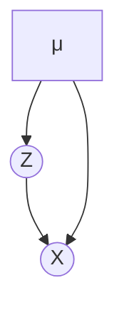

## 変分下限

$$
\begin{align}
\log (p (\bold{x}_{1:n} ) )
= & \log \left( \int p (\bold{x}_{1:n} , \gamma ) d \gamma \right) \\
= & \log \left( \int q ( \gamma ) \cdot \frac{ p (\bold{x}_{1:n}, \gamma ) } { q ( \gamma ) } \right) \\
\geq & \int q ( \gamma ) \cdot \log \left( \frac{ p (\bold{x}_{1:n}, \gamma) } { q ( \gamma) } \right) d\gamma
\end{align}
$$

最終行の式を evidence lower bound (ELBO) と呼び、以下のように定義する。
$$
ELBO (q(\gamma), p (\bold{x}_{1:n} , \gamma ) )
:= \mathbb{E}_{q ( \gamma ) } \log \left( \frac{ p (\bold{x}_{1:n}, \gamma ) } { q ( \gamma ) }  \right)
:= \int q ( \gamma ) \cdot \log \left( \frac{ p (\bold{x}_{1:n}, \gamma) } { q ( \gamma) } \right) d\gamma
$$
データの尤度 $ \log (p (\bold{x}_{1:n} ) ) $ と ELBO の差を計算すると、
$$
\begin{align}
& \log (p (\bold{x}_{1:n} ) )
- ELBO (q(\gamma), p (\bold{x}_{1:n} , \gamma ) ) \\
= & \log (p (\bold{x}_{1:n} ) )
- \int q ( \gamma ) \cdot \log \left( \frac{ p (\bold{x}_{1:n}, \gamma) } { q ( \gamma) } \right) d\gamma \\
= & \int \log \left( q ( \gamma ) \cdot \underbrace{\frac { p ( \bold{x}_{1:n} ) } { p (\bold{x}_{1:n}, \gamma ) } }_{ p ( \gamma | \bold{x}_{1:n} )^{-1}} \right) d\gamma \\
= & \int q (\gamma) \log \left( \frac { q ( \gamma ) } { p ( \gamma | \bold{x}_{1:n}\theta} \right)
:= KL ( q ( \gamma ) || p ( \gamma | \bold{x}_{1:n} ))
\end{align}
$$
であることから、
$$
\begin{align}
& \log (p (\bold{x}_{1:n} ) )
= ELBO (q(\gamma), p (\bold{x}_{1:n} , \gamma ) ) 
+ KL ( q ( \gamma ) || p ( \gamma | \bold{x}_{1:n} ))
\end{align}
$$
となる。

## EM アルゴリズム

$ p (\bold{x}_{1:n} | \bold{\theta} ) $ をパラメータ $ \theta $ を持つ確率分布の族、$ \gamma := \bold{z}_{1:n} $（ $ \bold{x}_{1:n} $ の離散的な潜在変数）、$ q(\bold{z}_{1:n}) := p ( \bold{z}_{1:n} | \bold{x}_{1:n}, \bold{\theta}_{t} ) $ とみなすと、
$$
\begin{align}
\log (p (\bold{x}_{1:n} | \bold{\theta} ) )
\geq & ELBO \left( p ( \bold{z}_{1:n} | \bold{x}_{1:n}, \bold{\theta}_{t} ), p (\bold{x}_{1:n}, \bold{z}_{1:n} | \bold{\theta} ) \right)
\end{align}
$$
と式変形ができる。

ELBO の項を $ \theta $ が関係する項と $ \theta $ が関係しない項に分類すると、
$$
\begin{align}
& ELBO \left( p ( \bold{z}_{1:n} | \bold{x}_{1:n}, \bold{\theta}_{t} ), p (\bold{x}_{1:n}, \bold{z}_{1:n} | \bold{\theta} ) \right) \\
= & \underbrace{ \left( \sum_{\bold{z}_{1:n} } p ( \bold{z}_{1:n} | \bold{x}_{1:n}, \bold{\theta}_{t} ) 
\log \left( p (\bold{x}_{1:n}, \bold{z}_{1:n} | \bold{\theta} ) \right) \right)}_{ \theta が関係する}
+ \underbrace{ \left( \sum_{\bold{z}_{1:n} }  p ( \bold{z}_{1:n} | \bold{x}_{1:n}, \bold{\theta}_{t} ) 
\log \left( p ( \bold{z}_{1:n} | \bold{x}_{1:n}, \bold{\theta}_{t} ) \right) \right)}_{ \theta が関係しない} \\
\end{align}
$$
と書ける。$ \theta $ が関係する項を $ Q( \theta; \theta_{t} ) := \sum_{\bold{z}_{1:n} } p ( \bold{z}_{1:n} | \bold{x}_{1:n}, \bold{\theta}_{t} ) 
\log \left( p (\bold{x}_{1:n}, \bold{z}_{1:n} | \bold{\theta} ) \right) $ と定義する。

- $ \theta_{0} $ を初期化する
- $ t = 0, \dots $ で以下のステップを繰り返す
  - E ステップ: $ p ( \bold{z}_{1:n} | \bold{x}_{1:n}, \bold{\theta}_{t} ) $ を計算する
  - M ステップ
    - $ Q( \theta; \theta_{t} ) $ を計算する
    - $ Q( \theta; \theta_{t} ) $ を最大にする $ \theta = \theta_{max} $ を求め $ \theta_{t + 1} \leftarrow \theta_{max}$ と更新する
  - 停止条件（あらかじめ決めた回数分ステップを繰り返すか、現在との更新値が一定以下を下回る、など）を満たした段階でループを抜ける

#### K-means

$$
p (X; Z = i, \mu) = \frac {1} {2 \pi \sigma^{\frac{n}{2}} } \exp \left( - \frac{(X - \mu_{i} )^{2}}{2 \sigma} \right)
$$

#### Gaussian

$ p ( \bold{z}_{1:n} | \bold{x}_{1:n}, \bold{\theta}_{t} ) $

## 変分ベイズ法

Latent Dirichlet Allocation (LDA) を例に考える。

## 変分推論 (Variational Inference; VI)

#### Automatic Differentiation Variational Inference (ADVI)

なぜ正規分布で近似してよいのか

Bernstein von mises の定理と呼ばれる以下の定理が成り立つから。

**Theorem (Bernstein von mises) の定理**