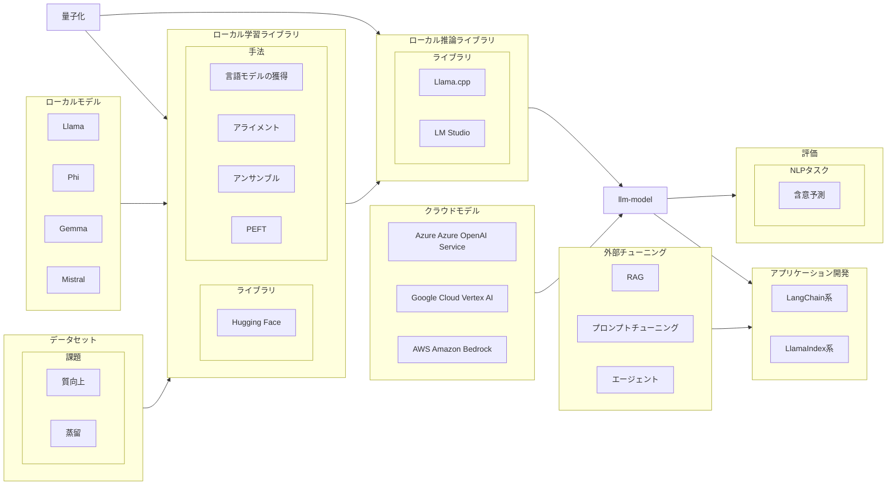

#### ローカルモデル

- Llama
  - Meta が開発した LLM モデル系列
- Phi
  - Microsoft が開発した SLM モデル系列
- Gemma
  - Google が開発した LLM モデル系列
  -  PaliGemma 2: VLM
- Mistral
  - Mistral AI が開発した LLM モデル系列
    - Mistral AI 社は、2023 年 4 月に Meta Platforms と Google DeepMind の元従業員によって設立された、パリに本社を置く AI 企業 
- Cohere
  - Command R+

#### ローカル学習ライブラリ

- Hugging Face が提供しているライブラリ群
  - transformers
  - peft
  - accelerate
  - diffusers
- 手法
  - 言語モデルの獲得
    - 継続事前学習
  - アライメント
    - 以下の 3 段階に分かれている
      - インストラクション・チューニング
        - インストラクション・データによる教師ありファインチューニング
      - DPO
        - 報酬モデルの作成
        - 報酬による強化学習
        - RLHF→DPO→KTOという発展の歴史がある
  - アンサンブル
    - Mixture of expert
    - モデルマージ
      - 進化的モデルマージ
  - Teacher-student or 蒸留
  - 量子化
    - bitsandbytes
  - その他の手法
    - ChatVector

#### ローカル推論ライブラリ

Hugging Face は Python で LLM モデルを読み込めるので当然推論にも使えるが、ローカル LLM の推論に特化しているわけではないので、上図からは省略している

- Hugging Face
  - Safetensors 形式のモデルパラメータを読み込める

- llama.cpp
  - GGUF 形式のモデルパラメータを読み込める
  - 当初は Mac で CPU 推論することを主目的としていたが、最近は CUDA もサポートしている
  - 量子化が可能
    - 量子化するには GGUF 形式にする必要がある

- Ollama
  - llama.cpp をバックエンドに手軽に LLM が実行できるアプリケーション
  - Python から Ollama を呼び出すライブラリも提供されている

#### クラウド LLM

- Azure Azure OpenAI Service
  - GPT-4
  - GPT-3.5
- Google Cloud Vertex AI
  - PaLM 2 for Text, Codey for Code Completion, etc.
- AWS Amazon Bedrock
  - Claude v2.x (Anthropic), Titan Text G1 - Express v1 (Amazon), etc.
- Anthropic
  - Claude 3.5 Sonnet

#### LLM開発フレームワーク

- LangChain 系
  - langchain-core
  - langchain-community
- LlamaIndex系

## 課題

#### モデルの性能を上げたい

- データセットの質の向上
- アンサンブル

#### モデルパラメータのメモリ使用量を減らしたい

- 量子化
- Teacher-student or 蒸留
- PEFT
- 分散処理？？

#### 学習・推論速度の向上

- 学習速度の向上
- 推論速度の向上

## ※ファインチューニングの種類

- 教師ありファインチューニング
  - BERT の時代では単にファインチューニングと呼ばれる
  - インストラクション・データによる教師ありファインチューニングをインストラクション・チューニングと呼ぶ
  - LLM 学習フェーズではアライメントに相当する
- 継続事前学習
  - 学習済みの言語モデルに対して、追加文章データを反映した言語モデルを学習するための手法
  - ラベルがついていない単なる文章データに対して実施していること、学習済みの言語モデルに対するファインチューニングであることから、区別するために既存のファインチューニングを教師ありファインチューニングと呼ぶようになったが、この手法自体は教師なしファインチューニングと呼ばれるわけでもなく、継続事前学習と呼ばれることになった
  - LLM 学習フェーズでは言語モデルの獲得に相当する
- PEFT (Parameter-Efficient Fine Tuning)
  - 大規模ネットワークのモデルパラメータを固定した上で、少量の追加パラメータの学習によってモデル出力を矯正する手法
  - 元々は拡散モデルのファインチューニングに使われていた
  - LLM の外部チューニング手法の一つである

