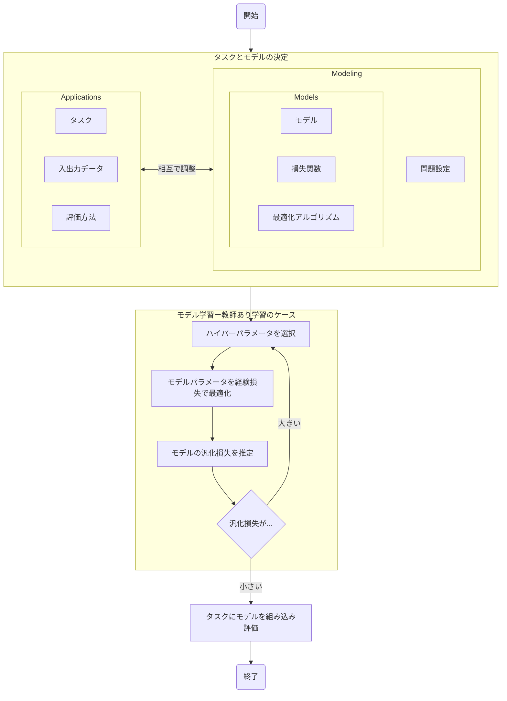

## 活用方法

- データ構造
  - テーブルデータ
  - 画像
  - テキスト
  - 音
  - 時系列データ
- 出力データ
  - カテゴリデータ
    - 不均衡データ
      - アンダーサンプリング
      - オーバーサンプリング
      - 重み付け変更

    - ノイジーラベル
    - 正例のみ

  - 順序データ

- タスク
  - NLP タスク（入力データがテキスト）
    - 出力データがラベル
      - 系列ラベリング
    - 出力データが画像
  - 出力データがない
    - 潜在変数モデル（トピックモデル）
  - 出力ラベルが不正確
    - PUラーニング
    - Confident Learning 
  - Pretraining 済みモデルの利用
    - 知識の蒸留
    - Teacher-student モデル
  - 特徴量抽出
    - 距離学習
  - 因果推論
  - 強化学習
  - レーティング・ランキング
  - 推薦
  - データ可視化

## モデリング

### 問題設定

- 教師あり学習
  - $ f_w: X \rightarrow \mathbb{R} $ として、$ \mathbb{E}_{X} (f(x; w)) $ を満たす $ w $ を求める問題。
  - バッチ学習
  - オンライン学習
  - 共変量シフト
  - 識別関数、識別モデル、生成モデル
- 数理最適化
  - $ f: X \rightarrow \mathbb{R} $ として、$ \min_{x\in X} f(x) $ を満たす $ x $ を求める問題
- その他アルゴリズム
  - 潜在変数推定
  - 次元削減
  - カーネル密度推定
  - ベイズ最適化
  - 曲線補間

### 教師あり学習

#### モデル

- 深層学習
  - 微分可能性
    - ソート
  - レイヤー
    - Layer Norm
    - 効率的なパラメータ更新
  - Pretraining
    - Pretraining 済みモデルの利用
      - 転移学習
      - 継続事前学習
  - Finetuning
  - 入力データがテキスト
    - Transformers
      - BERT
      - LLM
  - 出力データが画像
    - GAN
    - 拡散モデル
  
- 決定木ベース
  - Random forest (決定木 + バギング)
  - Gradient boosting decision tree (GBDT, 決定木 + ブースティング)
  
- 線形回帰・ロジスティック回帰・SVM

- 確率モデル + MCMC によるパラメータ推定

- アンサンブル学習
  - バギング
  - ブースティング
  
- 出力モデルの較正
  - 確率のキャリブレーション
  
    - ```
      from sklearn.calibration import calibration_curve
      ```

#### 損失関数

- 誤差関数
  - 二乗誤差損失
  - 絶対誤差
  - Huber 損失・Smooth $L^{1} $損失: 誤差が $ 0 $ の付近では二次関数で滑らかだが、それ以外では一次関数となる損失 
  - 分位点回帰
  - Hinge 損失: 主に SVM で使われる
  - Asymmetric loss
  - aleatoric uncertaanty loss
- 交差エントロピー (cross entropy)
  - Focal loss: 簡単に分類できる場合に損失を割り引く
  - Perplexity (= $ 2^{cross-entropy} $)
- 距離学習
  - cosine 類似度損失関数
  - 距離ベース: Triplet Loss
  - 角度ベース: ArcFace, AdaCos
- Kullback-Leibler divergence 損失
- 正則化項
  - $ L^{2} $-正則化: Ridge 回帰で使われる
  - $ L^{1} $-正則化: Lasso 回帰で使われる
  -  ElasticNet 正則化: $ L^{1} $- 正則化と $ L^{2} $- 正則化の和を使う
  - グループスパース正則化
  - トレースノルム正則化
- Auxiliary Loss: 損失関数の線形和を使う

#### 最適化アルゴリズム

- Stochastic gradient descent (SGD, 確率的勾配降下法)
- 近接勾配法
- 制約付き最適化
- 多様体上の最適化
- 連合学習

## あああ

- ハイパーパラメータチューニング
- モデルパラメータを経験損失で最適化
- モデルの汎化損失を推定
  - 学習・検証データを分割
  - 交差検証
  - ブートストラップ法

